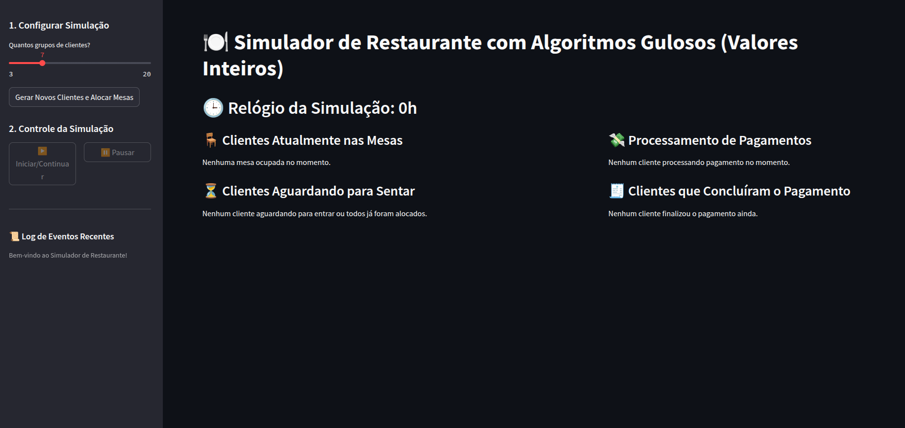
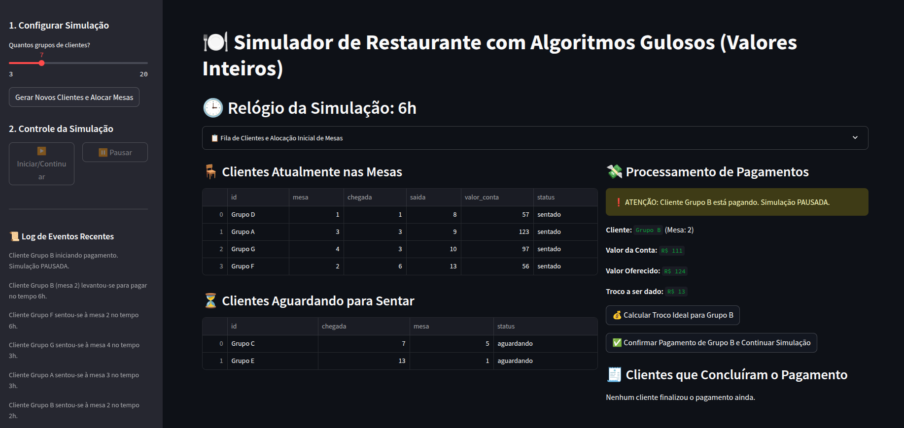
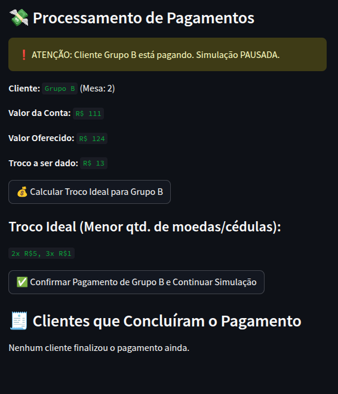

# Greed_Restaurante

**Conteúdo da Disciplina**: Algoritmos ambiciosos<br>

## Alunos
|Matrícula | Aluno |
| -- | -- |
| 22/2021890  |  Manuella Magalhães Valadares |
| 22/2021906  |  Marcos Vieira Marinho |

## Link do vídeo de apresentação do projeto


## ℹ️ Sobre o Projeto

Este projeto simula o funcionamento de um restaurante utilizando algoritmos gulosos para resolver dois problemas:

- **Alocação de Mesas:** Utiliza o algoritmo guloso de Interval Partitioning para minimizar o número de mesas necessárias, alocando grupos de clientes conforme seus horários de chegada e saída.
- **Cálculo de Troco:** Aplica o algoritmo guloso para fornecer o troco ideal (menor quantidade de moedas/cédulas) ao cliente, usando os valores disponíveis no caixa.

A interface permite gerar grupos de clientes aleatórios, acompanhar o fluxo do restaurante em tempo real, processar pagamentos e visualizar o troco calculado de forma otimizada.

## Screenshots

### Tela inicial
Funções de gerar clientes aleatórios e atribuir as mesas.


### Após gerar as mesas com o Interval Partitioning
O tempo vai rodando e pausa no momento em que alguém precisa pagar.


### Gerando troco com o algoritmos das moedas
Consideramos o nosso caixa com as notas de 100, 50, 20, 5 e 1 real.



## Instalação 
**Linguagem**: Python<br>
**Framework**: Streamlit<br>
**Pré-requisitos**: Python 3.8+

1. **Clone o repositório:**
```bash
git clone https://github.com/projeto-de-algoritmos-2025/Greed_Restaurante.git
cd Greed_Restaurante
```
2. **Instale as dependências:**
```bash
pip install streamlit heapq random pandas
```
## Uso 
Depois de instalar tudo corretamente, execute o seguinte comando no terminal:
```bash
streamlit run main.py
```
### Na interface web:
- Configure o número de grupos de clientes na barra lateral.
- Gere novos clientes e veja a alocação automática das mesas.
- Inicie a simulação, acompanhe o relógio e o status dos clientes.
- Processe pagamentos e veja o cálculo do troco ideal.
